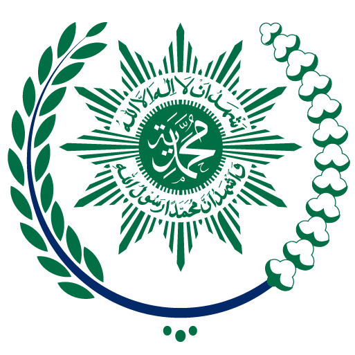

# 🎓 Biro Kemahasiswaan & AIK — Universitas Siber Muhammadiyah

<p align="center">
  
</p>

<p align="center">
  <strong>Portal Resmi Biro Kemahasiswaan dan Al-Islam Kemuhammadiyahan (AIK)</strong><br />
  <em>Universitas Siber Muhammadiyah (SiberMu)</em><br />
  <strong>"Ilmu • Teknologi • Akhlak Berkemajuan"</strong>
</p>

<p align="center">
  
  
  
  
  
</p>

---

## 📌 Tentang Proyek

Website resmi **Biro Kemahasiswaan & AIK Universitas Siber Muhammadiyah (SiberMu)** dirancang sebagai pusat informasi, pendampingan, dan aktualisasi mahasiswa di perguruan tinggi berbasis siber pertama di Indonesia milik Persyarikatan Muhammadiyah.

Portal ini memadukan estetika modern *cyber-campus* berteknologi tinggi dengan nilai luhur kepribadian Islam berkemajuan, menyajikan navigasi yang intuitif, desain responsif multi-perangkat (*smartphone*, *tablet/iPad*, dan *desktop*), serta performa halaman yang cepat.

---

## ✨ Fitur Unggulan

- 🧭 **Navigasi Presisi & Floating Drawer**:
  - Header navigasi cerdas yang beradaptasi secara dinamis saat digulir (*scroll-aware*).
  - *Floating mobile drawer* modern dengan tema putih bersih, teks *deep navy*, dan penanda menu aktif yang responsif.
  - Penutupan otomatis saat pengguna mengetuk di luar drawer (*click-outside detection*).
  - Utilitas smooth-scroll berulang yang andal (`scrollToId`), mencegah *lock-out* pada navigasi *anchor hash*.
- 🚀 **Hero Section Modern & Interaktif**:
  - Komposisi seimbang antara pesan institusional (*"Kembangkan Potensi, Teguhkan Karakter"*) dan representasi visual mahasiswa digital SiberMu.
  - Video showcase modal interaktif untuk mengenalkan profil universitas.
  - Indikator Mahasiswa Berkemajuan dengan akses langsung ke layanan kemahasiswaan.
- 🏛️ **Pilar Layanan Kemahasiswaan**:
  - Wadah Organisasi Mahasiswa (BEM, DPM, dsb.).
  - Akselerasi & Pembinaan Prestasi Mahasiswa di kancah nasional maupun internasional.
  - Unit Kegiatan Mahasiswa (UKM) berbasis minat, bakat, teknologi, dan kewirausahaan.
  - Layanan Terpadu Kesejahteraan & Konseling Mahasiswa.
- 🕌 **Pilar Al-Islam & Kemuhammadiyahan (AIK)**:
  - Pembinaan spiritual dan penguatan ideologi Muhammadiyah di era siber.
  - Kajian Islam tematik kontemporer dan literasi dakwah digital kreatif.
  - Internalisasi etika, integritas, dan akhlak berkemajuan.
- 📱 **Responsivitas Teruji di Segala Layar**:
  - Dioptimalkan untuk Mobile (360px – 430px), Tablet Portrait/Landscape (768px – 1024px, termasuk iPad Pro 1024×1366), serta Layar Lebar Desktop (1280px+).
  - Tanpa *horizontal scrollbar leak* (zero overflow).

---

## 🎨 Palet Warna & Desain Sistem

Desain website dibangun di atas fondasi warna resmi SiberMu yang harmonis dan profesional:

| Token Warna | Kode Hex | Peran dalam Desain |
| :--- | :---: | :--- |
| **Deep Navy (Brand Dark)** | `#070F1E` / `#0A192F` | Warna dasar header saat scroll, kartu visual, dan tipografi utama |
| **Tosca / Teal (Primary Accent)** | `#14B8A6` / `#0F9F91` | Aksen utama, tombol CTA, highlight aktif, dan ikon |
| **Light Mint (Soft Surface)** | `#E6F8F5` / `#F0FBF9` | Background pill menu aktif, badge, dan kartu sekunder |
| **Background Page** | `#F8FBFB` / `#F6FAF8` | Latar belakang halaman yang bersih, segar, dan nyaman di mata |
| **Pure White** | `#FFFFFF` | Latar kartu informasi, drawer melayang, dan kontras visual |

---

## 🛠️ Teknologi & Dependensi

Proyek ini dibangun menggunakan arsitektur web modern:

- **Framework**: [Next.js 16.3.4](https://nextjs.org/) (App Router & Turbopack)
- **UI Library**: [React 19](https://react.dev/)
- **Bahasa**: [TypeScript 5](https://www.typescriptlang.org/)
- **Styling**: [Tailwind CSS 4](https://tailwindcss.com/) dengan CSS Variables Design Tokens
- **Animasi**: [Framer Motion 13](https://motion.dev/)
- **Ikonografi**: [Lucide React](https://lucide.dev/)
- **Tipografi**: [Plus Jakarta Sans](https://fonts.google.com/specimen/Plus+Jakarta+Sans) & [Inter](https://fonts.google.com/specimen/Inter) via `next/font/google`

---

## 📁 Struktur Direktori

```text
├── app/
│   ├── globals.css          # Token desain Tailwind CSS 4 & styling global
│   ├── layout.tsx           # Root layout dengan konfigurasi font Google
│   ├── page.tsx             # Halaman utama (assembly seluruh section)
│   ├── icon.png             # Favicon & App Icon
│   └── apple-icon.png       # Apple Touch Icon
├── components/
│   ├── Navbar.tsx           # Navigasi sticky desktop & floating drawer mobile
│   ├── HeroSection.tsx      # Hero section, video modal, & visual SiberMu
│   ├── KemahasiswaanSection.tsx # Section ormawa, prestasi, UKM, & layanan
│   ├── AikSection.tsx       # Section pembinaan Al-Islam & Kemuhammadiyahan
│   ├── CTASection.tsx       # Call-to-action & portal layanan mahasiswa
│   └── Footer.tsx           # Footer institusi, kontak, dan tautan resmi
├── lib/
│   └── utils.ts             # Utilitas navigasi scrollToId & tailwind-merge (cn)
├── public/
│   ├── hero/                # Aset gambar & ilustrasi hero
│   └── icons/               # Logo resmi SiberMu & emblem institusi
├── package.json             # Konfigurasi dependensi dan skrip proyek
├── tsconfig.json            # Konfigurasi TypeScript
└── next.config.ts           # Konfigurasi Next.js
```

---

## 🚀 Panduan Memulai

### 1. Prasyarat Sistem
Pastikan telah menginstal [Node.js](https://nodejs.org/) (versi **20.x** atau yang lebih baru) dan npm.

### 2. Kloning Repositori
```bash
git clone https://github.com/aprilliobintang284/landingpage-sibermu.git
cd landingpage-sibermu
```

### 3. Instalasi Dependensi
```bash
npm install
```

### 4. Menjalankan Server Pengembangan
```bash
npm run dev
```
Buka browser dan akses [http://localhost:3000](http://localhost:3000).

### 5. Membangun untuk Produksi
```bash
npm run build
npm run start
```

### 6. Menjalankan Linter
```bash
node "./node_modules/eslint/bin/eslint.js" components/ lib/ app/
```

---

## 📄 Lisensi & Hak Cipta

Seluruh hak cipta dan merek dagang **Universitas Siber Muhammadiyah (SiberMu)** dilindungi. Dikembangkan untuk keperluan portal informasi Biro Kemahasiswaan & AIK.
